# MattchMoi

MattchMoi est une application de rencontre en ligne qui permet aux utilisateurs de trouver l'âme soeur ou simplement de bonnes amitiés en fonction de leurs préférences et de discuter avec d'autres utilisateurs en temps réel via un chat.

## Fonctionnalités

- Inscription et connexion : Les utilisateurs peuvent créer un compte et se connecter pour accéder à l'application.
- Profil utilisateur : Les utilisateurs peuvent personnaliser leur profil en ajoutant des informations telles que leur nom, leur description, leur âge, leur sexe, etc.
- Préférences de recherche : Les utilisateurs peuvent définir leurs préférences de recherche, telles que le type de relation recherché, le sexe préféré, la tranche d'âge, etc.
- Chat en temps réel : Les utilisateurs peuvent discuter avec leurs correspondances en temps réel via un chat intégré.
- Paramètres du compte : Les utilisateurs peuvent gérer leurs paramètres de compte, y compris la mise à jour du profil, la modification des préférences de recherche, etc.

## Technologies Utilisées

- Frontend : React.js, Axios, Tailwind CSS

- Backend : Nest.js , JWT pour l'authentification

- Chat : Express.js, Socket.io

- Base de données : MongoDB Atlas

## Installation

1. Cloner ce dépôt sur votre machine locale.
2. Naviguer dans le répertoire du projet.
3. Installer les dépendances en exécutant npm install dans le back/front.
4. Lancer l'application dans le back avec npm run start.
5. Lancer l'application dans le front avec npm start.
6. Lancer le serveur Express avec node index.js.

## Capture d'écran

    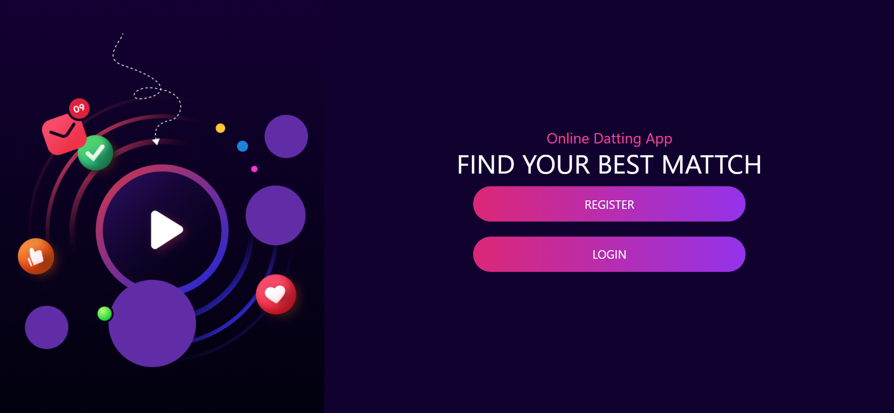
    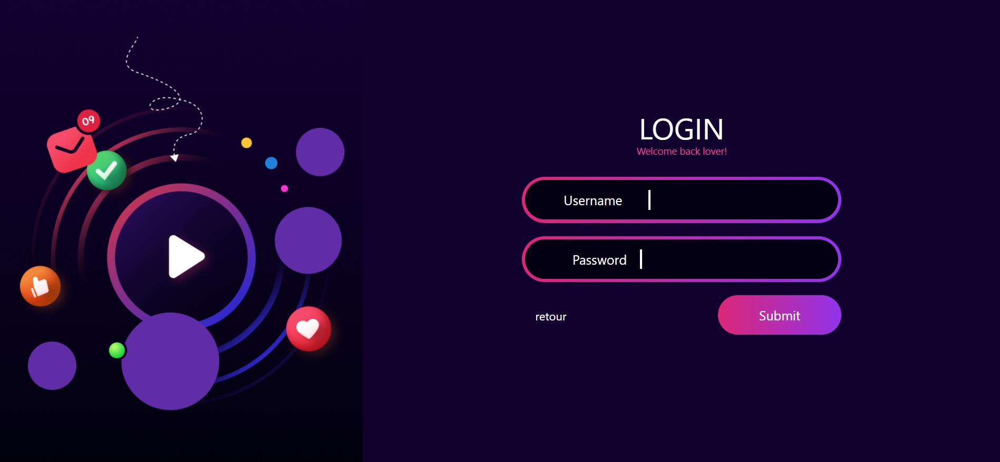
    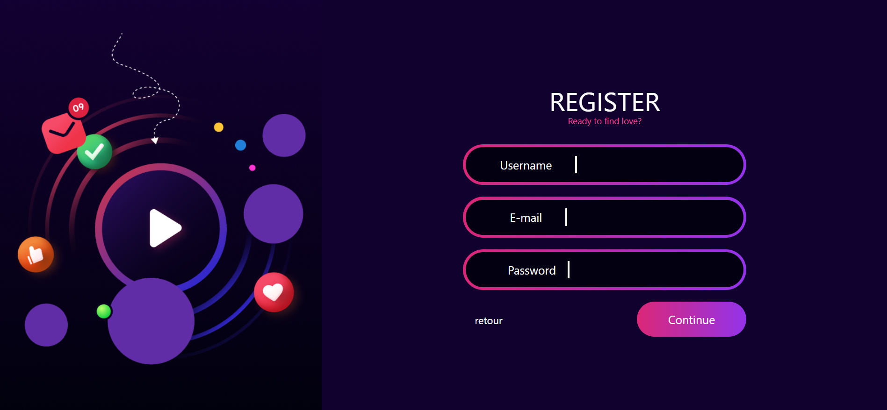
    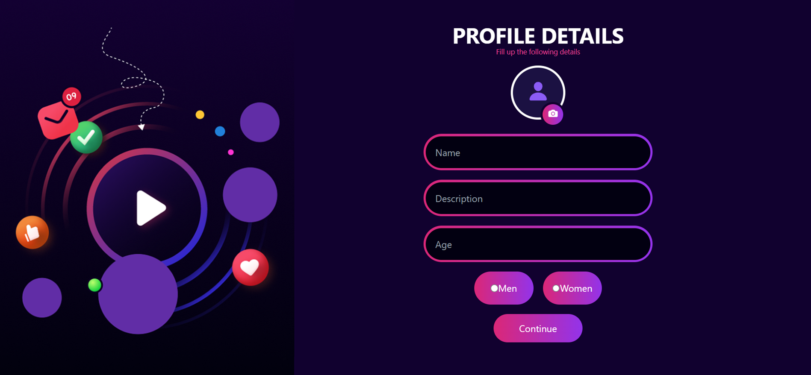
    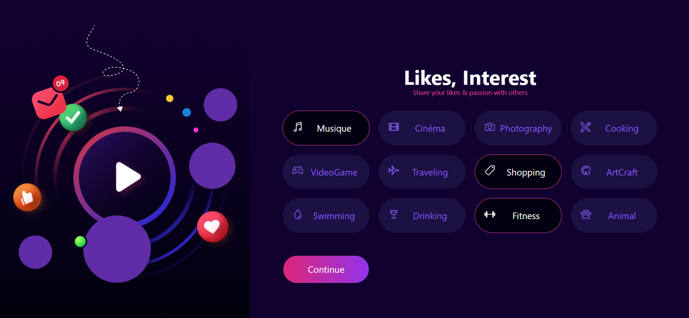
    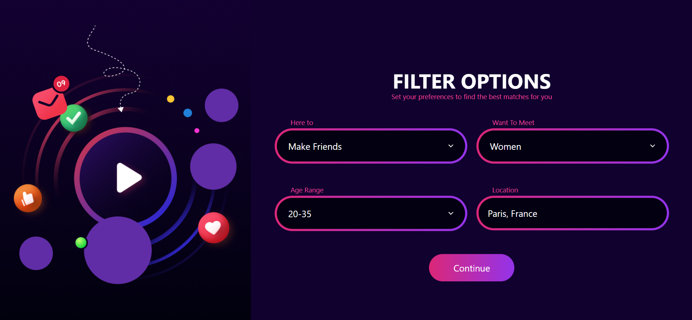
    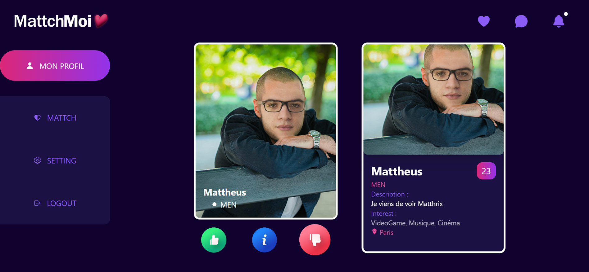
    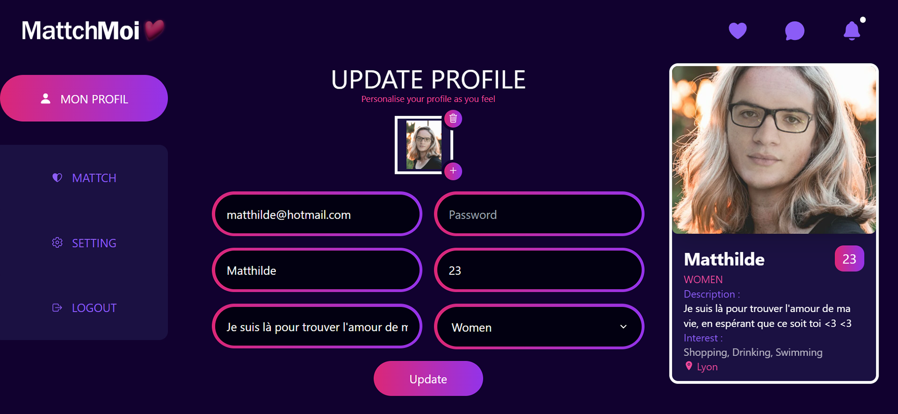
    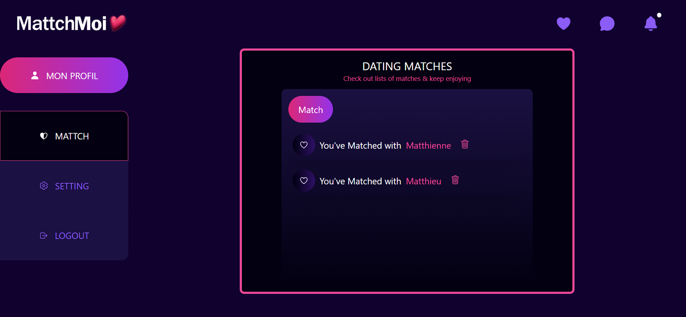
    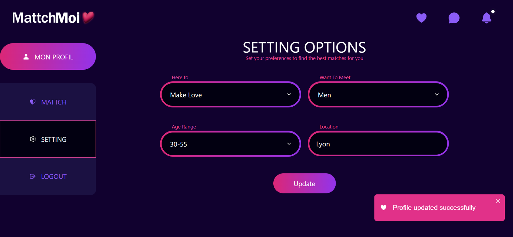
    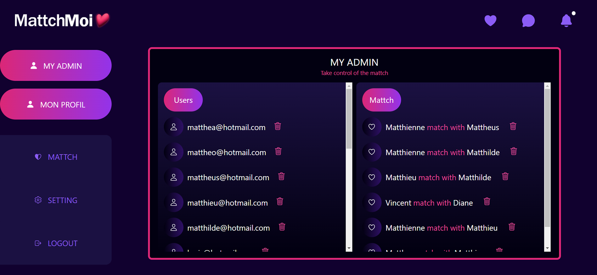

